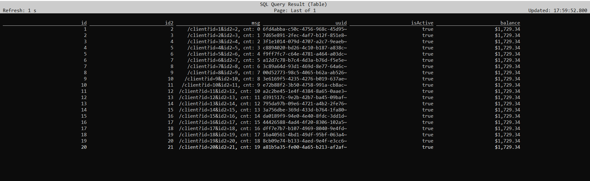

# flink-http-connector
The HTTP TableLookup connector that allows for pulling data from external system via HTTP GET method and HTTP Sink that allows for sending data to external system via HTTP requests.

#### HTTP TableLookup Source
The goal for HTTP TableLookup connector was to use it in Flink SQL statement as a standard table that can be later joined with other stream using pure SQL Flink.
 
Currently, HTTP TableLookup connector supports only Lookup Joins [1] and expects JSON as a response body. It also supports only the STRING types.

#### HTTP Sink
`HttpSink` supports both Streaming API (when using [HttpSink](src/main/java/com/getindata/connectors/http/sink/HttpSink.java) built using [HttpSinkBuilder](src/main/java/com/getindata/connectors/http/sink/HttpSinkBuilder.java)) and the Table API (using connector created in [HttpDynamicTableSinkFactory](src/main/java/com/getindata/connectors/http/table/HttpDynamicTableSinkFactory.java)). 

## Prerequisites
* Java 11
* Maven 3
* Flink 1.15+

## Installation

In order to use the `flink-http-connector` the following dependencies are required for both projects using a build automation tool (such as Maven or SBT) and SQL Client with SQL JAR bundles. For build automation tool reference, look into Maven Central: [https://mvnrepository.com/artifact/com.getindata/flink-http-connector](https://mvnrepository.com/artifact/com.getindata/flink-http-connector).

## Usage

### HTTP TableLookup Source
Flink SQL table definition:

```roomsql
CREATE TABLE Customers (
id STRING,
id2 STRING,
msg STRING,
uuid STRING,
isActive STRING,
balance STRING
) WITH (
'connector' = 'rest-lookup',
'url' = 'http://localhost:8080/client',
'asyncPolling' = 'true',
'field.isActive.path' = '$.details.isActive',
'field.balance.path' = '$.details.nestedDetails.balance'
)
```
Using _Customers_ table in Flink SQL Lookup Join:

```roomsql
SELECT o.id, o.id2, c.msg, c.uuid, c.isActive, c.balance FROM Orders AS o 
JOIN Customers FOR SYSTEM_TIME AS OF o.proc_time AS c ON o.id = c.id AND o.id2 = c.id2
```

The columns and their values used for JOIN `ON` condition will be used as HTTP get parameters where the column name will be used as a request parameter name. 
For Example: 
``
http://localhost:8080/client/service?id=1&uuid=2
``

### HTTP Sink
The following example shows the minimum Table API example to create a [HttpDynamicSink](src/main/java/com/getindata/connectors/http/table/HttpDynamicSink.java) that writes JSON values to an HTTP endpoint using POST method, assuming Flink has JAR of [JSON serializer](https://nightlies.apache.org/flink/flink-docs-release-1.15/docs/connectors/table/formats/json/) installed:

```roomsql
CREATE TABLE http (
  id bigint,
  some_field string
) WITH (
  'connector' = 'http-sink'
  'url' = 'http://example.com/myendpoint'
  'format' = 'json'
)
```

Then use `INSERT` SQL statement to send data to your HTTP endpoint:

```roomsql
INSERT INTO http VALUES (1, 'Ninette'), (2, 'Hedy')
```

Due to the fact that `HttpSink` sends bytes inside HTTP request's body, one can easily swap `'format' = 'json'` for some other [format](https://nightlies.apache.org/flink/flink-docs-release-1.15/docs/connectors/table/formats/overview/). 

Other examples of usage of the Table API can be found in [some tests](src/test/java/com/getindata/connectors/http/table/HttpDynamicSinkInsertTest.java).

## Implementation
Implementation of an HTTP source connector is based on Flink's `TableFunction` and `AsyncTableFunction` classes.  
To be more specific we are using a `LookupTableSource`. Unfortunately Flink's new unified source interface [2] cannot be used for this type of source.
Issue was discussed on Flink's user mailing list - https://lists.apache.org/thread/tx2w1m15zt5qnvt924mmbvr7s8rlyjmw

Implementation of an HTTP Sink is based on Flink's `AsyncSinkBase` introduced in Flink 1.15 [3, 4].

## Http Response to Table schema mapping
The mapping from Http Json Response to SQL table schema is done via Json Paths [5]. 
This is achieved thanks to `com.jayway.jsonpath:json-path` library.

If no `root` or `field.#.path` option is defined, the connector will use the column name as json path and will try to look for Json Node with that name in received Json. If no node with a given name is found, the connector will return `null` as value for this field. 

If the `field.#.path` option is defined, connector will use given Json path from option's value in order to find Json data that should be used for this column. 
For example `'field.isActive.path' = '$.details.isActive'` - the value for table column `isActive` will be taken from `$.details.isActive` node from received Json.

## Table API Connector Options
### HTTP TableLookup Source
| Option       | Required | Description/Value                                                                                                                                                                                                                         |
|--------------|----------|-------------------------------------------------------------------------------------------------------------------------------------------------------------------------------------------------------------------------------------------|
| connector    | required | The Value should be set to _rest-lookup_                                                                                                                                                                                                  |
| url          | required | The base URL that should be use for GET requests. For example _http://localhost:8080/client_                                                                                                                                              |
| asyncPolling | optional | true/false - determines whether Async Pooling should be used. Mechanism is based on Flink's Async I/O.                                                                                                                                    |
| root         | optional | Sets the json root node for entire table. The value should be presented as Json Path [5], for example `$.details`.                                                                                                                        |
| field.#.path | optional | The Json Path from response model that should be use for given `#` field. If `root` option was defined it will be added to field path. The value must be presented in Json Path format [5], for example `$.details.nestedDetails.balance` |

### HTTP Sink
| Option                     | Required | Description/Value                                                                                                                                                                                  |
|----------------------------|----------|----------------------------------------------------------------------------------------------------------------------------------------------------------------------------------------------------|
| connector                  | required | Specify what connector to use. For HTTP Sink it should be set to _'http-sink'_.                                                                                                                    |
| url                        | required | The base URL that should be use for HTTP requests. For example _http://localhost:8080/client_.                                                                                                     |
| format                     | required | Specify what format to use.                                                                                                                                                                        |
| insert-method              | optional | Specify which HTTP method to use in the request. The value should be set either to `POST` or `PUT`.                                                                                                |
| sink.batch.max-size        | optional | Maximum number of elements that may be passed in a batch to be written downstream.                                                                                                                 |
| sink.requests.max-inflight | optional | The maximum number of in flight requests that may exist, if any more in flight requests need to be initiated once the maximum has been reached, then it will be blocked until some have completed. |
| sink.requests.max-buffered | optional | Maximum number of buffered records before applying backpressure.                                                                                                                                   |
| sink.flush-buffer.size     | optional | The maximum size of a batch of entries that may be sent to the HTTP endpoint measured in bytes.                                                                                                    |
| sink.flush-buffer.timeout  | optional | Threshold time in milliseconds for an element to be in a buffer before being flushed.                                                                                                              |

## Build and deployment
To build the project locally you need to have `maven 3` and Java 11+. </br>

Project build command: `mvn package`. </br>
Detailed test report can be found under `target/site/jacoco/index.xml`.

## Demo application
You can test this connector using simple mock http server provided with this repository and Flink SQL-client. 
The mock server can be started from IDE (currently only this way) by running `HttpStubApp::main` method. 
It will start HTTP server listening on `http://localhost:8080/client`

Steps to follow:
- Run Mock HTTP server from `HttpStubApp::main` method.
- Start your Flink cluster, for example as described under https://nightlies.apache.org/flink/flink-docs-release-1.15/docs/try-flink/local_installation/
- Start Flink SQL Client [6] by calling: `./bin/sql-client.sh -j flink-http-connector-1.0-SNAPSHOT.jar`
- Execute SQL statements:
Create Data Stream source Table:
```roomsql
CREATE TABLE Orders (id STRING, id2 STRING, proc_time AS PROCTIME()
) WITH (
'connector' = 'datagen', 
'rows-per-second' = '1', 
'fields.id.kind' = 'sequence', 
'fields.id.start' = '1', 
'fields.id.end' = '120', 
'fields.id2.kind' = 'sequence', 
'fields.id2.start' = '2', 
'fields.id2.end' = '120'
);
```

Create Http Connector Lookup Table:
```roomsql
CREATE TABLE Customers (id STRING, id2 STRING, msg STRING, uuid STRING, isActive STRING, balance STRING
) WITH (
'connector' = 'rest-lookup', 
'url' = 'http://localhost:8080/client', 
'asyncPolling' = 'true', 
'field.isActive.path' = '$.details.isActive', 
'field.balance.path' = '$.details.nestedDetails.balance'
);
```

Submit SQL Select query to join both tables:
```roomsql
SELECT o.id, o.id2, c.msg, c.uuid, c.isActive, c.balance FROM Orders AS o JOIN Customers FOR SYSTEM_TIME AS OF o.proc_time AS c ON o.id = c.id AND o.id2 = c.id2;
```

As a result, you should see a table with joined records like so:


The `msg` column shows parameters used with REST call for given JOIN record.

## TODO

### HTTP TableLookup Source
- Implement caches.
- Add support for other Flink types. Currently, STRING type is only fully supported.
- Think about Retry Policy for Http Request
- Use Flink Format [7] to parse Json response 
- Add Configurable Timeout value
- Check other `//TODO`'s.

### HTTP Sink
- Make `HttpSink` retry the failed requests. Currently, it does not retry those at all, only adds their count to the `numRecordsSendErrors` metric. It should be thoroughly thought over how to do it efficiently and then implemented.

### 
[1] https://nightlies.apache.org/flink/flink-docs-release-1.15/docs/dev/table/sql/queries/joins/#lookup-join
</br>
[2] https://nightlies.apache.org/flink/flink-docs-release-1.15/docs/dev/datastream/sources/
</br>
[3] https://cwiki.apache.org/confluence/display/FLINK/FLIP-171%3A+Async+Sink
</br>
[4] https://nightlies.apache.org/flink/flink-docs-release-1.15/api/java/org/apache/flink/connector/base/sink/AsyncSinkBase.html
</br>
[5] https://support.smartbear.com/alertsite/docs/monitors/api/endpoint/jsonpath.html
</br>
[6] https://nightlies.apache.org/flink/flink-docs-master/docs/dev/table/sqlclient/
</br>
[7] https://nightlies.apache.org/flink/flink-docs-master/docs/connectors/table/formats/json/
</br>
